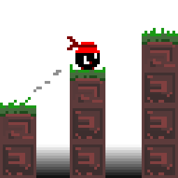

---

layout: default
title: Home
---

<nav style="margin-bottom: 15px;">
    <a href="/public/about">About</a> |
    <a href="/public/skills">Skills</a> |
    <a href="/public/projects">Projects</a> |
    <a href="/public/samples">Samples</a> |
    <a href="/public/documentation">Documentation</a> |
    <a href="/public/reflection">Reflection</a> |
    <a href="/public/contact">Contact</a>
</nav>

    

# Welcome

My name is Leon Wasiliew, and I am an IT Programming student at NSCC's Centre of Geographic Sciences (COGS). You are welcome to explore my portfolio.