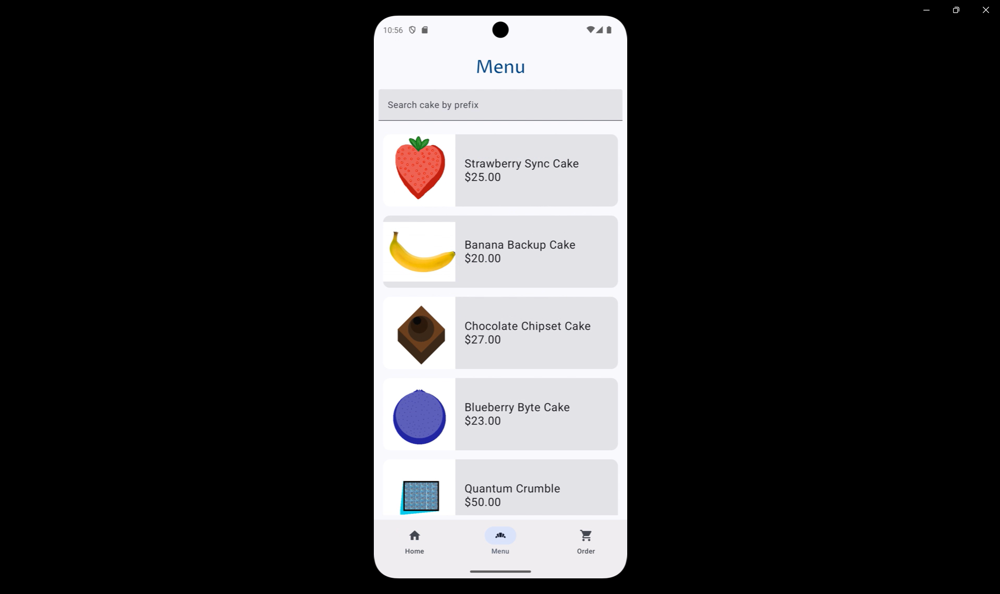
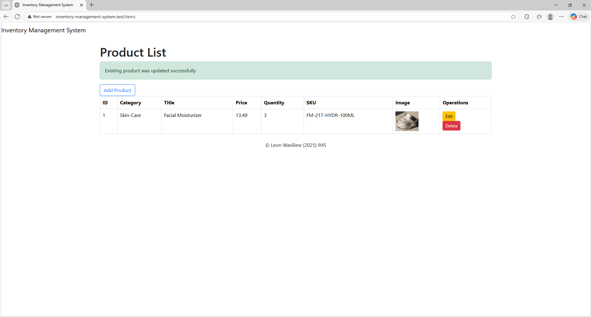
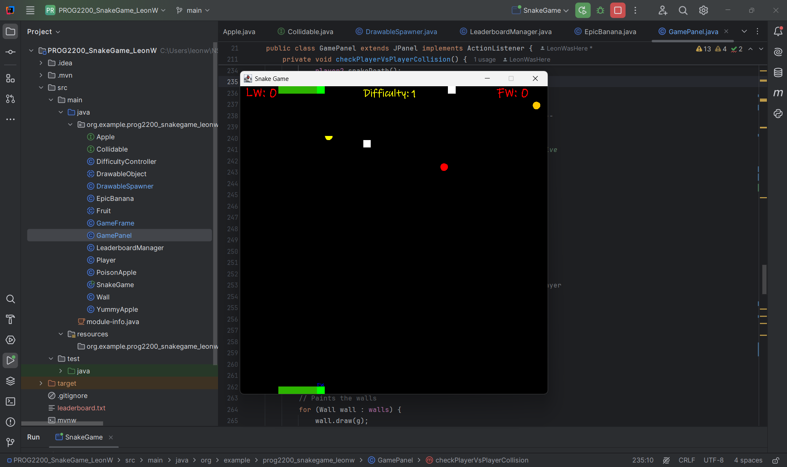
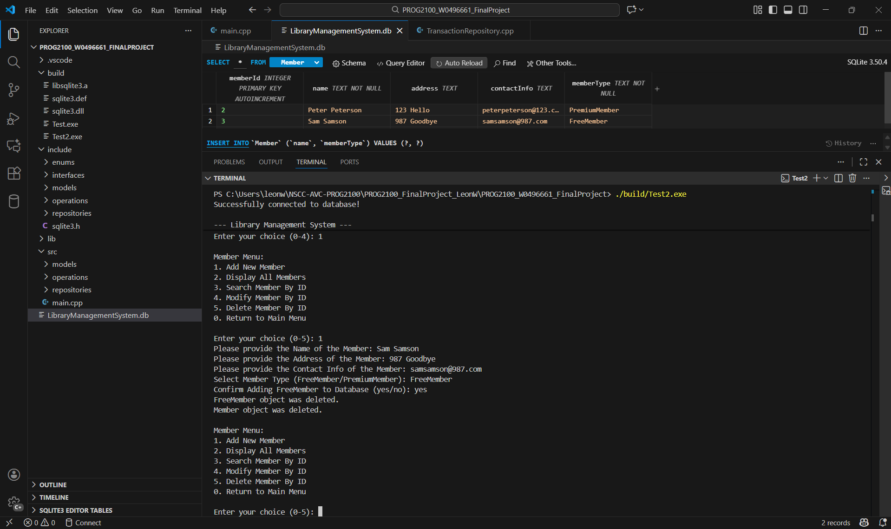
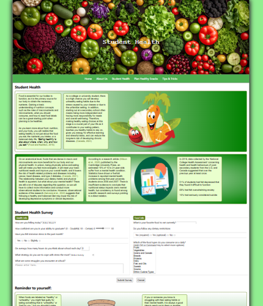
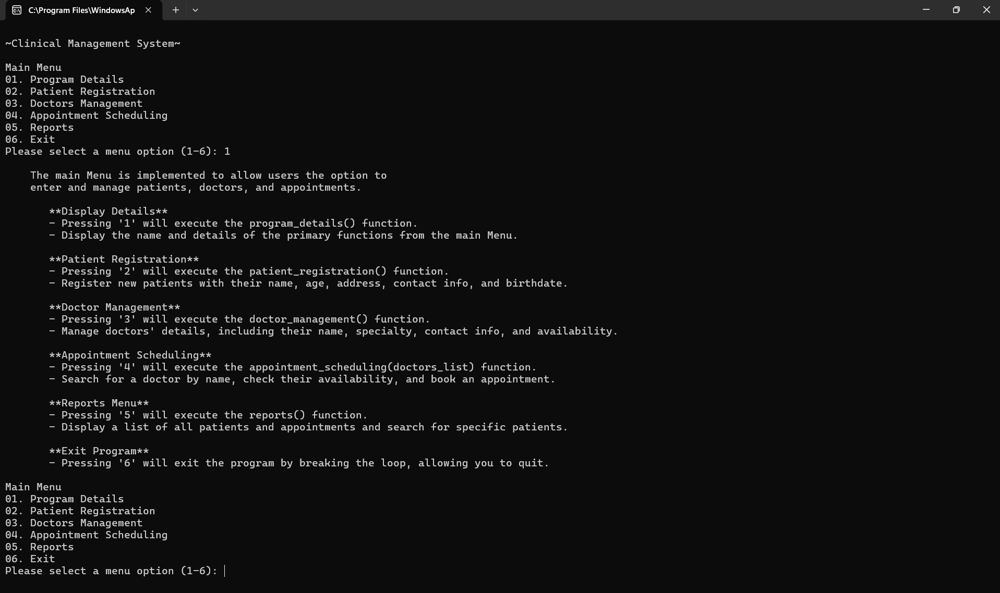
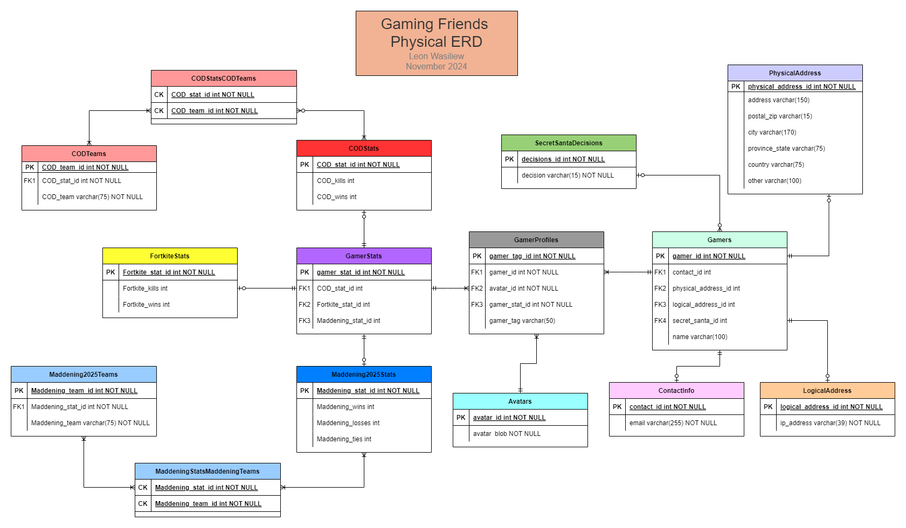
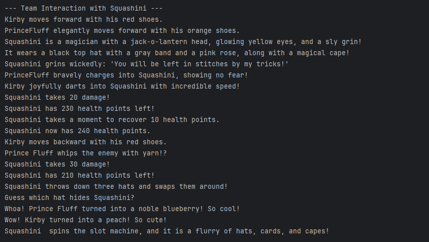
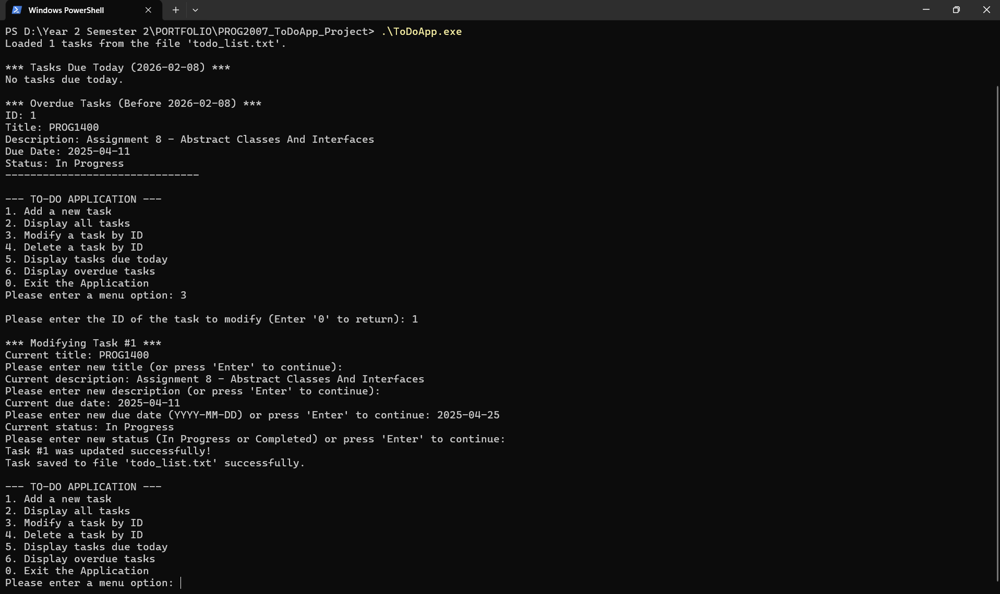
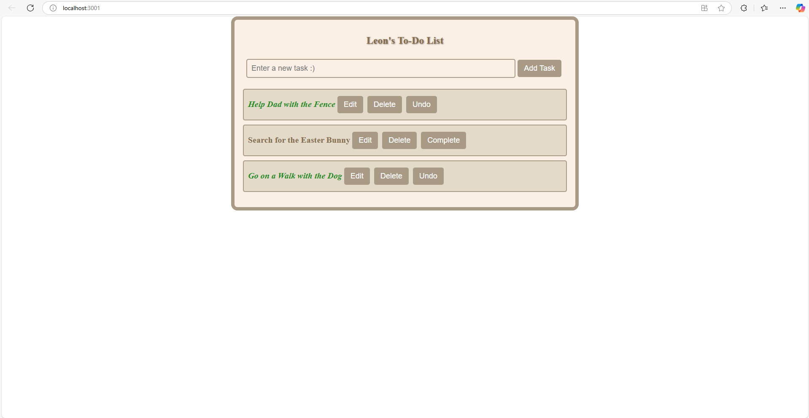

---

layout: default
title: Projects
---

<nav style="margin-bottom: 15px;">
    <a href="/public/about">About</a> |
    <a href="/public/skills">Skills</a> |
    <a href="/public/projects">Projects</a> |
    <a href="/public/samples">Samples</a> |
    <a href="/public/documentation">Documentation</a> |
    <a href="/public/reflection">Reflection</a> |
    <a href="/public/contact">Contact</a>
</nav>

# Projects

## COGS - Year 2

---

### MOBI3002 - Cake Ordering App
- **Description:** Android application where users can register or log in, browse a list of cakes, filter items, add cakes to a shopping cart, view items in the shopping cart, view the subtotal & total, and place an order that generates a receipt.
- **Technologies:** Android Studio, Kotlin, Jetpack Compose, SQLite, Krita
- **Type:** Individual
- **Screenshot:** 

---

### INET2005 - Inventory Management System
- **Description:** Inventory Management System built using Laravel Herd. Focus on MVVP architecture, includes CRUD operations for categories and items, connected to a web server and database.
- **Technologies:** Laravel, HTML, PHP, Blade Templates, XAMPP
- **Type:** Individual
- **Screenshot:** 

---

### PROG2200 - Snake Game
- **Description:** Extended version of Bro Code's Java Snake Game template. Added OOP improvements, asynchronous multiplayer features, and high-score tracking using file handling.
- **Technologies:** Java Swing, JavaFX, IntelliJ IDEA, File Handling, OOP
- **Type:** Individual
- **Screenshot:** 

---

### PROG2100 - Library Management System
- **Description:** C++ Library Management System implementing OOP principles, header/source file separation, and file handling. Supports member registration (Free/Premium), borrowing books, and calculating dues.
- **Technologies:** C++, Visual Studio Code, File Handling, OOP
- **Type:** Individual
- **Screenshot:** 

---

## COGS - Year 1

---

### WEBD1000 - Lean & Green Eats Website
- **Description:** A website promoting healthy eating and habits. Three-person project where I contributed two webpages, styling components, documentation, and integration work.
- **Technologies:** HTML, CSS, Visual Studio Code
- **Type:** Team of 3
- **Screenshot:** 

---

### PROG1700 - Clinical Management System
- **Description:** CLI-based Python system supporting patient registration, doctor management, appointment scheduling, and report generation.
- **Technologies:** Python, Visual Studio Code, File Handling
- **Type:** Team of 4
- **Screenshot:** 

---

### DBAS1007 - Gaming Friends Database
- **Description:** Designed ERD, SQL entities, and relations from scratch. Wrote DDL and DML to automatically generate the database.
- **Technologies:** MySQL, SQLite, ERD, CSV
- **Type:** Individual
- **Screenshot:** 

---

### PROG1400 - OPP-Based Kirby Game
- **Description:** Text-based game focused on demonstrating OOP inheritance principles. Uses the characters and bosses from Kirby's Epic Yarn including Fangora and Squashini.
- **Technologies:** Java, IntelliJ IDEA, OOP
- **Type:** Individual
- **Screenshot:** 

---

### PROG2007 - CLI To-Do Application
- **Description:** Command-line task manager supporting adding tasks, modifying by ID, deleting by ID, showing tasks due today, and listing overdue tasks.
- **Technologies:** C, Visual Studio Code, File Handling
- **Type:** Individual
- **Screenshot:** 

---

### PROG2700 - GUI To-Do Application
- **Description:** Graphical to-do list application supporting adding, editing, completing, and deleting tasks.
- **Technologies:** HTML, CSS, JavaScript, React, Visual Studio Code
- **Type:** Individual
- **Screenshot:** 

---